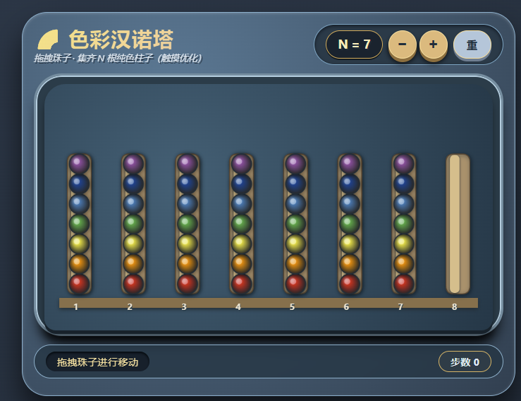

# 色彩汉诺塔 · Colorful Hanoi Puzzle

> 一个基于颜色分类的益智游戏，灵感来自汉诺塔，但玩法完全不同。  
> 在线试玩：https://ZXNPC.github.io

## 游戏简介

桌面上有 **N+1** 根柱子。前 N 根柱子上从底部到顶部依次叠放着颜色 1、颜色 2 …… 颜色 N 的珠子（每根柱子都是这种混合顺序），第 N+1 根柱子为空。  
您的目标是通过移动珠子，让任意 **N** 根柱子上的所有珠子颜色完全相同（纯色柱），此时游戏胜利。

## 玩法规则

- **移动方式**：每次只能移动 **一根柱子最顶部的珠子**。
- **移动限制**：
    - 源柱子不能为空；
    - 目标柱子不能已满（高度 ≤ N）；
    - **无需颜色匹配** —— 任何珠子都可以移动到任何未满的柱子上（自由移动模式）。
- **胜利条件**：存在 N 根柱子，每根柱子的高度均为 N，且每根柱子上的所有珠子颜色一致。
- **难度调节**：通过界面上的 `+` / `-` 按钮调整 N 值（2 到 10），柱子数量和高度会同步变化。

## 特性亮点

- 🎨 **高对比度配色**：精心挑选的 10 种颜色（红、橙、黄、绿、青、蓝、紫、粉、棕、灰），即使 N=10 也能清晰区分。
- 📱 **自适应画布**：柱子间距根据总数自动计算，在任何 N 值下都能完整显示。
- 🖱️ **直观操作**：点击柱子选中，再点击另一根柱子移动；选中状态有高亮边框。
- 🔄 **实时反馈**：步数计数、胜利提示、错误移动提醒一应俱全。
- 🎮 **自由模式**：移除了传统汉诺塔的颜色匹配限制，让策略更灵活，专注于颜色分类。

## 如何本地运行

1. 下载本仓库的 `index.html` 文件。
2. 使用现代浏览器（Chrome、Firefox、Edge 等）打开该文件。
3. 开始游戏！所有功能离线可用，无需网络。

## 技术栈

- **HTML5 Canvas**：绘制柱子与珠子。
- **CSS3**：界面美化与布局。
- **原生 JavaScript**：游戏逻辑与交互。

## 贡献指南

欢迎提出 Issue 或 Pull Request！  
如果您有任何改进建议（例如增加更多颜色、优化动画效果、添加移动音效等），请随时参与。

1. Fork 本仓库
2. 创建您的特性分支 (`git checkout -b feature/AmazingFeature`)
3. 提交您的修改 (`git commit -m 'Add some AmazingFeature'`)
4. 推送到分支 (`git push origin feature/AmazingFeature`)
5. 打开一个 Pull Request

## 许可证

本项目采用 MIT 许可证，您可以自由使用、修改和分发。

---

**祝您玩得开心！** 🎉

---

## 📚 开发参考

本游戏的交互设计与迭代过程参考了以下 DeepSeek 对话记录：  
[点击查看完整讨论](https://chat.deepseek.com/share/ivenq87no88jk7xiqg)

灵感来源于：[这条微博](https://weibo.com/7301389190/QuHlEEQDF)